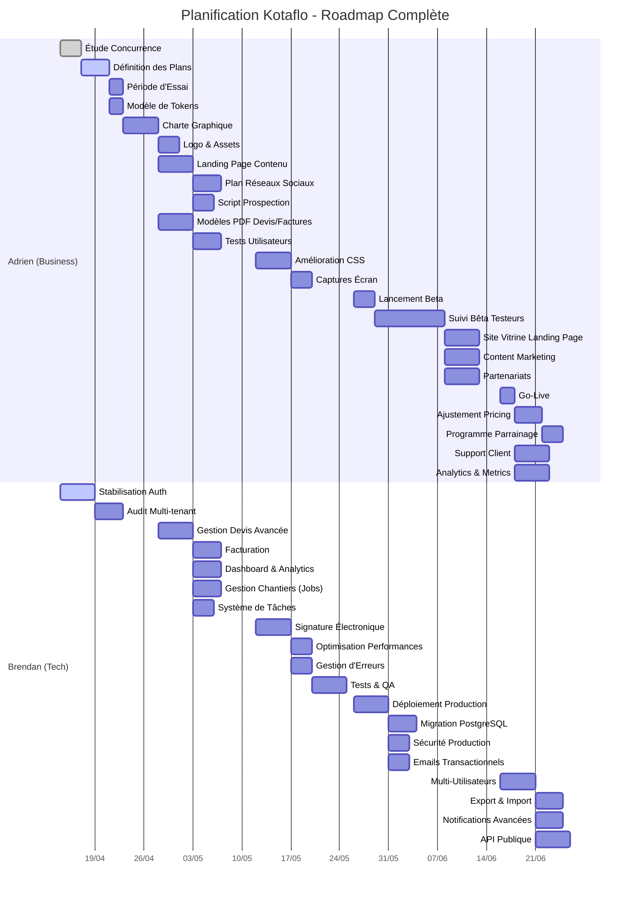

# 🗺️ Roadmap Projet Kotaflo

Ce document présente la roadmap complète du projet Kotaflo, organisée par phases et priorités. Il combine les tâches business/marketing (Adrien) et les développements techniques.

---

## 📊 Diagramme de Gantt



---

## 📊 Vue d'Ensemble

```
Phase 1 — Fondations (Semaines 1-2)
    ↓
Phase 2 — Core Features (Semaines 3-5)
    ↓
Phase 3 — Polish & UX (Semaines 6-7)
    ↓
Phase 4 — Beta & Acquisition (Semaines 8-10)
    ↓
Phase 5 — Lancement & Scale (Semaines 11+)
```

---

## 🎯 Phase 1 : Fondations & Stratégie (Semaines 1-2)

### 💰 Business Model & Pricing
**Responsable : Adrien**
**Priorité : HAUTE — à faire en premier**

- [x] **Étude de la concurrence** ✅ TERMINÉE
  - Analyser Tolteck, Obat, Henrri et autres acteurs
  - Documenter : prix, fonctionnalités, limites
  - Identifier notre positionnement (niche, avantage concurrentiel)
  - **Deliverable** : Tableau comparatif concurrentiel (`veille_concurrentielle/`)

  **💡 Insights Clés issus de l'étude :**
  - **Modèle de tokens** : Aucun concurrent ne propose de paiement à l'usage pur → opportunité de différenciation totale
  - **Mode hors-ligne robuste** : Talon d'Achille de Costructor, Obat → kritikal pour Kotaflo
  - **Premier devis en < 2 minutes** : Tolteck = 30 min d'onboarding → objectif Kotaflo : radical simplicity

- [ ] **Définition des plans d'abonnement** 🔲 EN COURS
  - **Free**
    - Limite de clients (ex: 20)
    - Limite de devis/mois (ex: 5)
    - Pas de signature électronique
    - Fonctionnalités de base uniquement
  - **Pro** (~29-49€/mois)
    - Clients illimités
    - Devis/factures illimités
    - Signature électronique incluse
    - Export PDF personnalisé
    - Support email prioritaire
  - **Enterprise** (~79-99€/mois)
    - Multi-utilisateurs (2+)
    - API access
    - Support dédié
    - Formation onboarding
    - Custom branding
  - **Deliverable** : Matrice des features par plan

- [ ] **Période d'essai** 🔲 À faire juste après les plans
  - Durée recommandée : **14 jours**
  - Sans CB pour réduire la friction
  - Accès complet à toutes les features Pro
  - Email de rappel à J-3 et J-1 avant fin
  - **Deliverable** : Spécifications du workflow d'essai

- [ ] **Modèle de Tokens pour les devis**
  - Option A : 1 devis envoyé = 1 token (packets de 10, 50, 100)
  - Option B : Abonnement avec quota mensuel (ex: 30 devis/mois en Pro)
  - Option C : Illimité dans les plans payants
  - **Recommandation** : Option B pour contrôler les coûts SMTP/PDF
  - **Deliverable** : Documentation de la logique de tokens

### 🎨 Identité Visuelle
**Responsable : Adrien**
**Note : Démarrage après la définition des plans et de la période d'essai**

- [ ] **Charte Graphique**
  - Palette principale :
    - Primaire : Bleu professionnel (#2563EB ou similaire)
    - Secondaire : Orange dynamique (#F97316 ou similaire)
    - Neutres : Gris clair/foncé pour textes et fonds
  - Typographie : Police lisible et moderne (Inter, Roboto)
  - **Deliverable** : Guide des couleurs et typographies

- [ ] **Logo & Assets**
  - Créer le logo Kotaflo (format SVG + PNG)
  - Favicon pour le navigateur
  - Icônes pour la sidebar et l'interface
  - **Deliverable** : Kit de marque complet

### 🏗️ Technical — Backend Core
**Responsable : Brendan**

- [ ] **Stabilisation de l'authentification**
  - Tester login/register complet
  - Valider Google OAuth
  - Vérifier la gestion des sessions JWT
  - **Deliverable** : Auth flow 100% fonctionnel

- [ ] **Architecture Multi-tenant**
  - Valider l'isolation des données par `tenant_id`
  - Tester les requêtes croisées (pas de fuite de données)
  - **Deliverable** : Audit de sécurité multi-tenant

---

## 🎯 Phase 2 : Core Features (Semaines 3-5)

### 📢 Marketing & Acquisition
**Responsable : Adrien**

- [ ] **Landing Page — Contenu**
  - **Hero Section**
    - Titre accrocheur : "Gérez votre entreprise artisanale en 1 clic"
    - Sous-titre : "Devis, factures, chantiers — simple, rapide, professionnel"
    - CTA : "Essai gratuit 14 jours"
  - **Bénéfices Utilisateurs**
    - ⏱️ Gagnez 2h par jour sur l'administratif
    - 📱 Accessible partout, même sur smartphone
    - ✍️ Devis signés électroniquement par vos clients
    - 💰 Relances automatiques pour les impayés
  - **Social Proof**
    - Témoignages bêta testeurs (à collecter)
    - Logos partenaires (si applicable)
  - **FAQ**
    - Questions fréquentes des artisans
  - **Deliverable** : Maquette wireframe de la landing page

- [ ] **Plan Réseaux Sociaux**
  - **Instagram/Tik Kotaflo**
    - Créer les comptes
    - Bio optimisée avec lien d'essai gratuit
  - **Contenu — Série "Productivité Artisan"**
    - Post 1 : "Comment j'ai arrêté de perdre 2h par jour sur mes devis"
    - Post 2 : "L'erreur qui coûte 3000€/an aux artisans"
    - Post 3 : "Devis non signé = chantier perdu (statistique)"
    - Post 4 : "La relance facture qui marche à 90%"
    - Format : Carrousels Instagram + vidéos courtes TikTok
  - **Calendrier éditorial**
    - 3 posts/semaine minimum
    - Stories quotidiennes (coulisses, tips)
  - **Deliverable** : Calendrier éditorial 30 jours + 10 posts prêts

- [ ] **Script de Prospection Beta**
  - **Cible** : Artisans sur Facebook (groupes pros), LinkedIn
  - **Message type** :
    ```
    Salut [Prénom] 👋
    
    Je développe Kotaflo, un logiciel de gestion pour artisans
    (devis, factures, chantiers, signature électronique).
    
    Je cherche 10 testeurs pour la version Beta gratuite.
    Tu serais partant pour tester et me donner ton avis ?
    
    Ça dure 2 min pour s'inscrire : [lien]
    Et ça peut te faire gagner 2h/semaine 🚀
    ```
  - **Objectif** : 10 bêta testeurs actifs
  - **Deliverable** : Script finalisé + liste de 50 prospects à contacter

### 🛠️ Améliorations Produit (Low-Code)
**Responsable : Adrien**

- [ ] **Modèles de Devis/Factures PDF**
  - Travailler avec `fpdf2` dans `backend/services/quote_service.py`
  - Améliorer le design :
    - Logo entreprise en haut
    - Tableau propre avec lignes alternées
    - Couleurs de la charte
    - Mentions légales complètes (SIRET, TVA, IBAN)
    - Conditions de paiement
  - **Deliverable** : 2 templates PDF (devis + facture) professionnels

- [ ] **Tests Utilisateurs — Parcours Plombier**
  - Se mettre dans la peau d'un artisan plombier
  - Tester tous les workflows :
    1. Créer un compte → configurer profil
    2. Ajouter un client
    3. Créer un devis
    4. Envoyer le devis pour signature
    5. Signer le devis
    6. Convertir en facture
    7. Créer un chantier
    8. Ajouter des tâches
  - **Documenter** :
    - Bugs visuels
    - Points de friction (clics inutiles, confusion)
    - Fonctionnalités manquantes
    - Suggestions d'amélioration
  - **Deliverable** : Rapport de tests avec screenshots + liste de bugs

### 🏗️ Technical — Features Core
**Responsable : Brendan**

- [ ] **Gestion des Devis Avancée**
  - Lignes de devis avec calcul automatique (TVA, total)
  - Support des avenants (parent_quote_id)
  - Expiration automatique des devis
  - Envoi par email avec template professionnel
  - **Deliverable** : Module devis complet

- [ ] **Facturation**
  - Conversion devis → facture
  - Gestion des acomptes (deposit, deposit_balance)
  - Relances automatiques (factures en retard)
  - Export PDF facture
  - **Deliverable** : Module facturation complet

- [ ] **Dashboard & Analytics**
  - Vue d'ensemble : clients, devis en cours, factures impayées
  - Graphiques : revenus mensuels, taux de conversion devis
  - KPIs : nombre de chantiers en cours, tâches en retard
  - **Deliverable** : Dashboard interactif

- [ ] **Gestion des Chantiers (Jobs)**
  - CRUD complet avec statuts (planned, ongoing, done)
  - Timeline des interventions
  - Association clients, devis, factures, tâches
  - **Deliverable** : Module chantiers complet

- [ ] **Système de Tâches**
  - Création avec priorités et dates limites
  - Association à clients et/ou chantiers
  - Notifications (email ou in-app)
  - **Deliverable** : Module tâches complet

---

## 🎯 Phase 3 : Polish & UX (Semaines 6-7)

### 🎨 Design & Interface
**Responsable : Adrien**

- [ ] **Amélioration CSS**
  - Travailler dans `static/css/`
  - Moderniser les tableaux :
    - Hover effects
    - Badges colorés pour les statuts
    - Pagination propre
  - Améliorer les formulaires :
    - Labels clairs
    - Messages d'erreur explicites
    - Validation en temps réel
  - Responsive design (mobile-first)
  - **Deliverable** : UI moderne et cohérente sur toutes les pages

- [ ] **Captures d'écran pour Documentation**
  - Réaliser des screenshots propres de chaque page
  - Annoter si nécessaire (flèches, textes)
  - Format : 1200x800px minimum
  - **Deliverable** : 10-15 screenshots professionnels pour README et site

### 🏗️ Technical — Stabilisation
**Responsable : Brendan**

- [ ] **Signature Électronique**
  - Flux complet : envoi code view → vérification → envoi code sign → signature
  - Journal d'audit (signature_events)
  - Génération du PDF signé
  - Sécurité : rate limiting sur les codes
  - **Deliverable** : Signature électronique 100% fonctionnelle

- [ ] **Optimisation des Performances**
  - Index base de données (vérifier les requêtes lentes)
  - Pagination sur les listes (clients, devis, factures)
  - Cache pour les requêtes fréquentes
  - **Deliverable** : Temps de réponse < 500ms

- [ ] **Gestion d'Erreurs**
  - Messages d'erreur utilisateur-friendly
  - Logging côté backend
  - Fallbacks gracieux (ex: email non envoyé)
  - **Deliverable** : UX d'erreur améliorée

- [ ] **Tests & QA**
  - Tests unitaires sur les services critiques (auth, quotes, invoices)
  - Tests d'intégration sur les workflows complets
  - Tests de sécurité (injection, XSS, CSRF)
  - **Deliverable** : Coverage tests > 60%

---

## 🎯 Phase 4 : Beta & Acquisition (Semaines 8-10)

### 📢 Beta Publique
**Responsable : Adrien + Brendan**

- [ ] **Lancement Beta**
  - Inviter les 10 premiers testeurs (prospection Phase 2)
  - Créer un groupe Slack/Discord pour le support
  - Collecter les feedbacks systématiquement
  - **Deliverable** : 10 bêta testeurs actifs

- [ ] **Suivi des Bêta Testeurs**
  - Check-in hebdomadaire (email ou call)
  - Questionnaire de satisfaction (NPS)
  - Liste des bugs remontés
  - Feature requests prioritaires
  - **Deliverable** : Rapport de feedback beta (après 2 semaines)

- [ ] **Itérations Rapides**
  - Corriger les bugs critiques sous 48h
  - Implémenter les features demandées si alignées avec la vision
  - Communication transparente avec les testeurs
  - **Deliverable** : 2-3 sprints d'itération basés sur les feedbacks

### 📢 Marketing — Préparation Lancement
**Responsable : Adrien**

- [ ] **Site Vitrine — Landing Page**
  - Designer et développer la page d'accueil publique
  - Intégrer les témoignages beta testeurs
  - Ajouter les captures d'écran du produit
  - Formulaire d'inscription essai gratuit
  - **Deliverable** : Landing page live

- [ ] **Content Marketing**
  - Articles de blog :
    - "Comment choisir son logiciel de gestion pour artisans"
    - "Devis électronique : la fin du papier ?"
    - "5 erreurs qui coûtent cher aux artisans (et comment les éviter)"
  - SEO : optimiser pour "logiciel gestion artisan", "devis gratuit", etc.
  - **Deliverable** : 3 articles de blog publiés

- [ ] **Partenariats**
  - Contacter des organisations professionnelles (CAPEB, etc.)
  - Proposer des tarifs préférentiels à leurs adhérents
  - Explorer les partenariats avec des fournisseurs de matériaux
  - **Deliverable** : 2-3 partenariats en discussion

### 🏗️ Technical — Production Ready
**Responsable : Brendan**

- [ ] **Déploiement Production**
  - Configurer le serveur (VPS ou cloud)
  - Nginx + Gunicorn
  - HTTPS (Let's Encrypt)
  - Backups automatiques des BDD
  - Monitoring (uptime, erreurs)
  - **Deliverable** : Application déployée et accessible

- [ ] **Migration PostgreSQL** (si nécessaire)
  - Adapter les modèles pour PostgreSQL
  - Migrer les données SQLite
  - Tester les performances
  - **Deliverable** : BDD PostgreSQL opérationnelle

- [ ] **Sécurité Production**
  - Rate limiting sur tous les endpoints
  - Headers de sécurité (CSP, X-Frame-Options, etc.)
  - Validation des inputs utilisateur
  - Audit de sécurité complet
  - **Deliverable** : Application sécurisée

- [ ] **Emails Transactionnels**
  - Templates professionnels (devis, factures, rappels)
  - Configuration SMTP production
  - Testing deliverability (spam vs inbox)
  - **Deliverable** : Emails délivrés correctement

---

## 🎯 Phase 5 : Lancement & Scale (Semaines 11+)

### 💰 Business — Lancement Officiel
**Responsable : Adrien**

- [ ] **Go-Live**
  - Annoncer le lancement sur les réseaux sociaux
  - Email aux prospects collectés pendant la beta
  - Press release pour les médias spécialisés
  - **Objectif** : 50 inscrits le premier mois

- [ ] **Stratégie de Prix — Ajustement**
  - Analyser les données d'utilisation beta
  - Ajuster les plans si nécessaire (features, limites, prix)
  - Tester différents pricing (A/B testing si possible)
  - **Deliverable** : Pricing final validé par le marché

- [ ] **Programme de Parrainage**
  - "Parrainez un artisan, gagnez 1 mois gratuit"
  - Incitations pour les deux parties
  - Tracking des referrals
  - **Deliverable** : Programme de parrainage lancé

- [ ] **Support Client**
  - Documentation utilisateur (FAQ, tutos)
  - Base de connaissances
  - Support email (SLA < 24h)
  - Chatbot ou live chat (optionnel)
  - **Deliverable** : Système support opérationnel

### 🏗️ Technical — Features Avancées
**Responsable : Brendan**

- [ ] **Multi-Utilisateurs** (Plan Enterprise)
  - Gestion des rôles (admin, user)
  - Permissions par fonctionnalité
  - Invitation d'utilisateurs
  - **Deliverable** : Module multi-users

- [ ] **Export & Import**
  - Export CSV des clients
  - Import CSV pour migration depuis d'autres outils
  - Export PDF en masse (factures, devis)
  - **Deliverable** : Module import/export

- [ ] **Notifications Avancées**
  - Rappels automatiques (factures impayées, devis à relancer)
  - Notifications in-app
  - Préférences de notification par utilisateur
  - **Deliverable** : Système de notifications complet

- [ ] **API Publique** (future intégration)
  - Documentation Swagger/OpenAPI
  - Endpoints pour intégrations tierces
  - API keys management
  - **Deliverable** : API documentée et accessible

### 📈 Scale — Croissance
**Responsable : Adrien + Brendan**

- [ ] **Analytics & Metrics**
  - Dashboard interne : MRR, churn, LTV, CAC
  - Tracking utilisateur (Plausible, GA4)
  - Analyse des entonnoirs de conversion
  - **Deliverable** : Tableau de bord métriques SaaS

- [ ] **Application Mobile** (long terme)
  - PWA (Progressive Web App) pour commencer
  - Native iOS/Android si traction
  - **Objectif** : Accès mobile pour les artisans sur le terrain

- [ ] **Intégrations**
  - Comptabilité (QuickBooks, Cegid)
  - Paiement en ligne (Stripe)
  - Signature électronique avancée (DocuSign API)
  - Calendrier (Google Calendar)
  - **Deliverable** : Marketplace d'intégrations

- [ ] **Fonctionnalités Avancées**
  - Gestion des stocks et matériaux
  - Planning et calendrier intégré
  - Module de paiement en ligne
  - Rapports et statistiques avancés
  - **Deliverable** : Features premium pour différenciation

---

## 📅 Timeline Récapitulative

| Phase | Durée | Objectif Principal | Milestone Clé |
|-------|-------|-------------------|---------------|
| **1. Fondations** | S1-2 | Stratégie + Identité | Charte graphique + Pricing défini |
| **2. Core Features** | S3-5 | Développement | Tous les modules fonctionnels |
| **3. Polish & UX** | S6-7 | Qualité | UI moderne + Tests passing |
| **4. Beta & Acquisition** | S8-10 | Validation marché | 10 bêta testeurs actifs |
| **5. Lancement & Scale** | S11+ | Croissance | 50+ inscrits mois 1 |

---

## 🎯 Métriques de Succès

### Phase 1-3 (Pré-Lancement)
- [ ] Charte graphique validée
- [ ] Pricing défini et documenté
- [ ] Landing page prête
- [ ] 50 prospects contactés
- [ ] Tous les modules core fonctionnels
- [ ] Tests utilisateurs réalisés

### Phase 4 (Beta)
- [ ] 10 bêta testeurs actifs
- [ ] NPS > 40
- [ ] < 5 bugs critiques ouverts
- [ ] 80% de rétention semaine 2
- [ ] Landing page live

### Phase 5 (Lancement)
- [ ] 50+ inscrits mois 1
- [ ] 10+ utilisateurs payants
- [ ] Churn < 5%
- [ ] Support SLA < 24h
- [ ] MRR initial validé

---

## 👥 Répartition des Rôles

### Adrien — Business, Produit & UX/UI
- Stratégie de pricing et business model
- Marketing et acquisition
- Design et UX/UI (templates HTML/CSS)
- Intégration APIs d'IA (Vibe Coding)
- Tests utilisateurs
- Support client
- Contenu et communication

### Brendan — Architecture Technique & Backend
- Backend Flask et API
- Architecture base de données (SQLite → PostgreSQL)
- Système de paiement et modèle de tokens (backend)
- Sécurité et performances
- Déploiement et infrastructure
- Tests et QA
- Intégrations techniques

### Collaboration
- **Daily** : Sync rapide (15 min) sur les avancements
- **Weekly** : Revue de sprint et planification
- **Mensuel** : Revue des métriques et ajustements stratégiques

---

## 🚦 Statut Actuel

**Phase en cours** : **Phase 1 — Fondations**

**Priorité actuelle** : Définition des plans + période d'essai (Adrien)

**Prochains livrables attendus** :
1. ~~Adrien : Tableau comparatif concurrentiel (S1)~~ ✅ FAIT
2. Adrien : Définition des plans d'abonnement + période d'essai (EN COURS)
3. Brendan : Stabilisation auth + audit multi-tenant (S1-2)
4. Adrien : Modèle de tokens (après les plans)
5. Adrien : Charte graphique + Logo (après la période d'essai)

---

*Dernière mise à jour : Avril 2026*
*Document vivant — à mettre à jour à chaque sprint*
